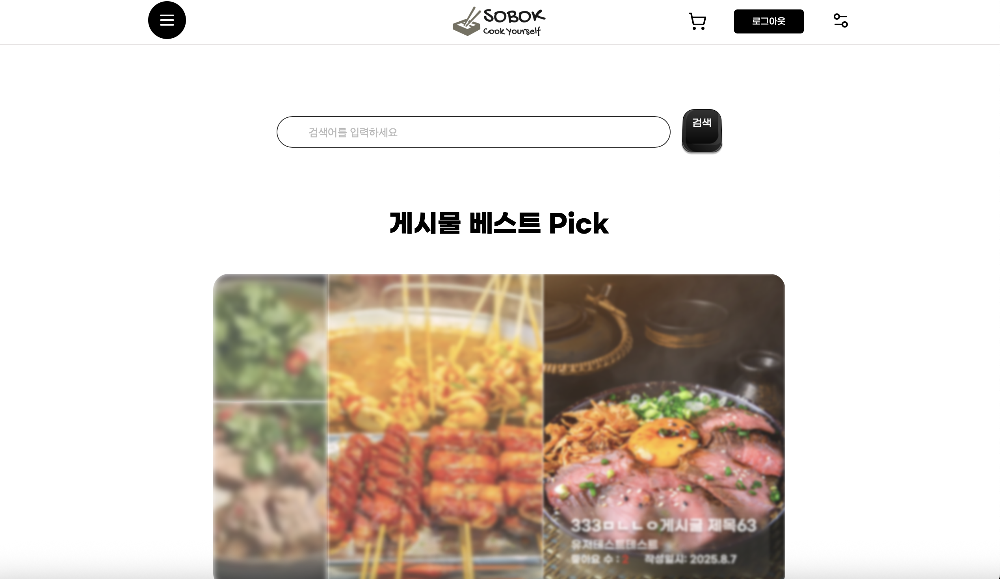
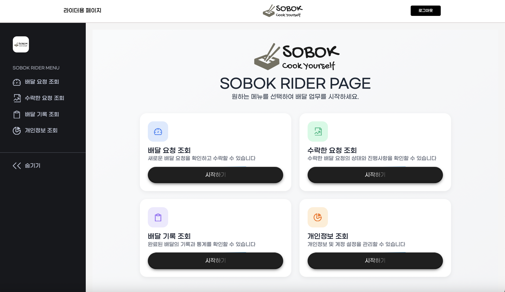
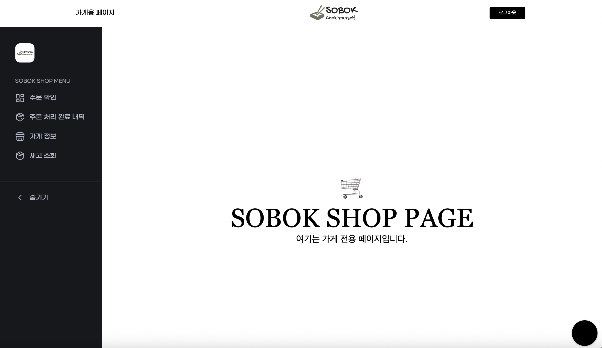
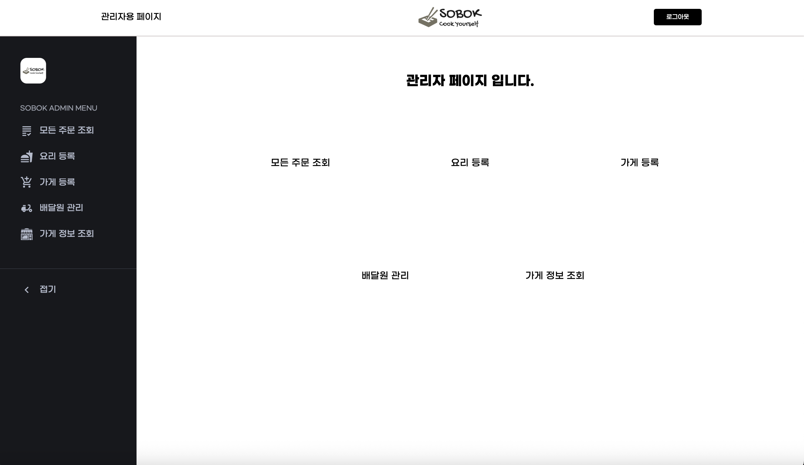

# **소복 Sobok : 식재료 큐레이션 배달 서비스**

<br>
<br>
<div align="center">


</div>
<br>
<br>

---
<br>

## 💻 개발 주소

<br>

**로컬 주소 : [http://localhost:5173](http://localhost:5173)** <br>

**배포 주소 : [https://sobok.shop](https://sobok.shop)** <br>

<br>

## 🥘 프로젝트 개요

<br>

본 프로젝트는 요리를 하고 싶지만 **장보기의 번거로움**, **식재료 낭비**, **영양 불균형 등으로 인해 요리를 실천하지 못하는 1인 가구**를 위한 **식재료 큐레이션 배달 서비스**입니다.

<br>

## ℹ️ 프로젝트 정보

<br>

**플레이데이터 8기 3조 Final Project : Sobok(소복) 배달 시스템** <br>

**개발 기간** : **2025. 6. 21  ~ 2025. 8. 13**

<br>

## 🙋‍♂️ 팀소개

<br>
<br>

| 강하늘 <br> (Devy17) | 김현지 <br> (vbnmopas) | 한종균 <br> (HanJongKyun) | 김수영 <br> (SUEYOUNG14) | 유승현 <br> (youthdonut) |
| :----------: | :----------: | :----------: | :----------: | :----------: |
|  |  |  |  | 
| [https://github.com/Devy17](https://github.com/Devy17) | [https://github.com/vbnmopas](https://github.com/vbnmopas) | [https://github.com/HanJongKyun](https://github.com/HanJongKyun) | [https://github.com/SUEYOUNG14](https://github.com/SUEYOUNG14) | [https://github.com/youthdonut](https://github.com/youthdonut) |
| **Infra** | **Backend** | **Backend** | **Frontend** | **Frontend** |

<br>
<br>

# 🥮 요구사항

<br>

- **Node.js 22.14.0**
- **Npm 11.3.0**
- **React 19.1.0**
- **Redux 9.2.0**
- **Vite 6.3.5**

<br>

# 🍩 Installation & execute

<br>

```

$ git clone https://github.com/playdata-8th-full-stack-baedal-service/sobok-fe.git 

$ cd sobok-fe

$ npm install

$ npm run dev

```

<br>

## 🍳 주요 기능

<br>

- **사용자 페이지: 식재료 검색, 주문 기능, 게시글 작성 및 조회**

- **가게 페이지 : 주문 접수, 재고 관리**

- **라이더 페이지 : 배달 현황 조회**

- **관리자 페이지: 식재료 및 요리 등록, 전체 서비스 관리**

<br>

## 🍱 화면 구성 예시

<br>
<br>

| 사용자 메인페이지 | 라이더 메인페이지 | 
| :----------: | :----------: | 
|  |  | 
| **가게 메인페이지** | **관리자 메인페이지** |
|  |  |

<br>
<br>

## 🍡 기술 스택

<br>

<div align="center">

### Environment

<br>


</div>

<br>

<div align="center">

### Development

<br>


 <br>


 <br>


</div>

<br>

<div align="center">

### Communication

<br>


</div>

<br>
<br>

## 🍲 개발 환경 설정

<br>

```bash
# 의존성 설치
npm install

# 개발 서버 실행
npm start
```

<br>

## 🍤 배포

<br>

GitHub Actions를 통해 CI/CD가 구성되어 있습니다.

<br>

### 🍣 주요 작업


#### 1. 코드 체크아웃

**GitHub 레포지토리의 코드를 가져옵니다.**

#### 2. Node.js 환경 설정

**Node.js 22버전을 사용합니다.**

#### 3. 의존성 설치

**`npm install` 명령어로 필요한 라이브러리 설치**

#### 4. 빌드

**`npm run build`로 React 프로젝트를 빌드합니다. `CI=false`를 지정하여 경고를 오류로 처리하지 않도록 설정**

#### 5. S3 업로드

**빌드된 정적 파일(`dist` 폴더)을 S3에 업로드합니다. `--delete`플래그를 통해 S3에서 제거된 파일도 반영**

#### 6. CloudFront 캐시 무효화

**배포 후 CloudFront 캐시를 무효화하여 변경된 내용이 즉시 반영되도록 합니다.**

<br>

### 🍕 사용되는 GitHub Secrets

1. **AWS_ACCESS_KEY_ID : AWS 액세스 키** 

2. **AWS_SECRET_ACCESS_KEY : AWS 시크릿 키**

3. **AWS_REGION : AWS 리전**

4. **S3_BUCKET : 배포 대상 S3 버킷 이름**

5. **CF_DISTRIBUTION_ID : CloudFront 배포 ID**

<br>

### 🍥 참고 사항

**CloudFront를 사용하는 경우, S3에 새 파일이 업로드되어도 CloudFront의 캐시 때문에 변경 사항이 바로 반영되지 않을 수 있습니다.**

**⇒ 이를 해결하기 위해 GitHub Actions에서 CloudFront 캐시 무효화(Invaldation)를 자동으로 수행합니다.**

<br>

**빌드된 정적 파일은 `dist/` 디렉토리에 생성되며, 해당 폴더의 파일들이 S3 버킷에 업로드됩니다.**

<br>

**캐시 무효화 경로는 `"/*"`로 지정되어 있어, 전체 파일 변경 사항이 반영됩니다.
필요 시 성능 향상을 위해 무효화 범위를 특정 경로로 제한할 수 있습니다.**

<br>

## 🍙 아키텍쳐

### 디렉토리 구조

```
📦sobok-fe
 ┣ 📂.github 
 ┃ ┣ 📂ISSUE_TEMPLATE : Issue 관리 템플릿
 ┃ ┃ ┣ 📜feature.yml
 ┃ ┃ ┣ 📜fix.yml
 ┃ ┃ ┗ 📜refactor.yml
 ┃ ┣ 📂workflows
 ┃ ┃ ┗ 📜main.yml
 ┃ ┗ 📜pull_request_template.md
 ┣ 📂src
 ┃ ┣ 📂assets
 ┃ ┣ 📂common : 공통적으로 사용하는 컴포넌트 저장
 ┃ ┃ ┣ 📂base : 공통으로 사용하는 색, 여러 스타일, 함수, 믹스인, 폰트 스타일 저장
 ┃ ┃ ┣ 📂components : 공통 버튼, input 등의 공통 요소
 ┃ ┃ ┣ 📂forms : form형식에 들어가는 공통 요소
 ┃ ┃ ┣ 📂hooks : 유형별 토스트 메시지 관련 파일
 ┃ ┃ ┣ 📂modals : 모달 관리 파일 
 ┃ ┃ ┣ 📂styles : 폰트 등의 전역적으로 적용되는 스타일 파일
 ┃ ┃ ┗ 📂utils : 여러 컴포넌트에 사용하는 로직 파일
 ┃ ┣ 📂layout : 공통 헤더 및 푸터 관리 
 ┃ ┣ 📂pages 
 ┃ ┃ ┣ 📂admin : 관리자 관련 페이지 컴포넌트
 ┃ ┃ ┣ 📂auth : auth 관련 페이지  컴포넌트
 ┃ ┃ ┣ 📂hub : 가게 관련 페이지 컴포넌트
 ┃ ┃ ┣ 📂rider : 라이더 관련 페이지 컴포넌트
 ┃ ┃ ┗ 📂user : 사용자 관련 페이지 컴포넌트
 ┃ ┣ 📂queries
 ┃ ┣ 📂router : 라우더 설정 파일
 ┃ ┣ 📂services : API 요청 및 인증 처리를 담당하는 axios 인스턴스와 백엔드 호스트 설정을 포함한 유틸리티 파일
 ┃ ┣ 📂store : 앱 전역 상태 관리와 관련된 Redux store 및 slice 모듈이 위치한 파일
 ┃ ┣ 📜.env : 환경 변수들을 저장하는 환경 설정 파일
 ┃ ┣ 📜App.jsx
 ┃ ┣ 📜index.css
 ┃ ┣ 📜main.jsx
 ┃ ┗ 📜reset.css : 브라우저 간 기본 스타일 차이를 없애기 위해 사용하는 CSS 초기화 파일
 ┣ 📜.gitignore
 ┣ 📜LICENSE : 프로젝트의 사용, 수정, 배포에 대한 권한과 조건을 명시한 라이선스 파일
 ┣ 📜README.md
 ┣ 📜index.html
 ┣ 📜package-lock.json
 ┣ 📜package.json
 ┗ 📜vite.config.js

 ```
